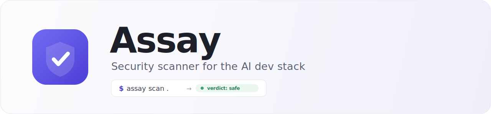
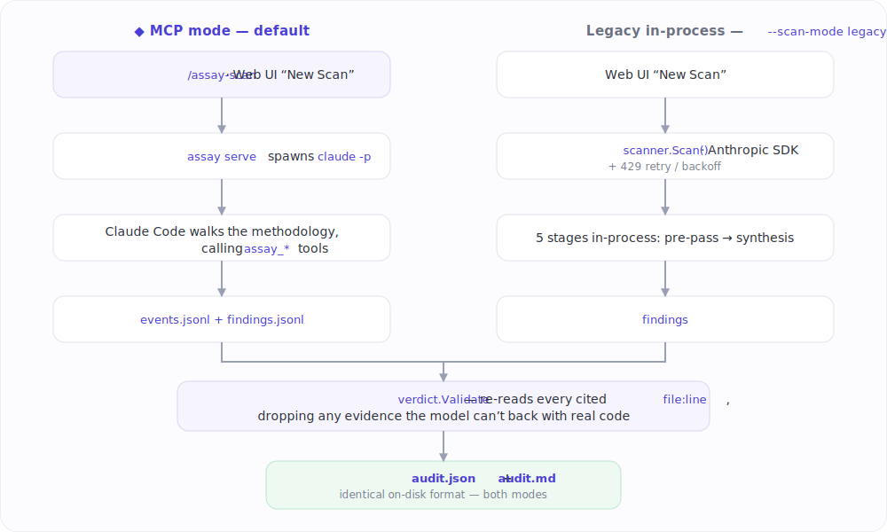

<p align="center">
  
</p>

<p align="center">
  <a href="LICENSE"></a>
  
  
  
  <a href="https://github.com/chawdamrunal/assay/stargazers"></a>
</p>

<p align="center">
  <b>Reasons about an artifact with an LLM — not regex — to catch prompt injection, credential exfiltration, and MCP tool poisoning in Claude Code plugins, MCP servers, hooks, skills &amp; connectors.</b><br>
  Runs on your <b>Claude Code subscription</b> — no separate API key required.
</p>

## What it does

Assay scans a Claude Code plugin, MCP server, or local directory using a citation-verified 5-stage methodology:

1. **Triage** — map the artifact: entry points, declared permissions, files worth reading
2. **Claim extraction** — what does it *claim* to do?
3. **Threat model** — given the claims, where could it go wrong? (done *before* reading source code)
4. **Investigation** — read code, gather evidence for each threat
5. **Synthesis** — verdict + audit.md with verbatim file:line citations

Every finding has a verbatim quoted snippet from the file. The post-validator re-reads the file and drops anything the LLM can't back up with real code.

## How scans run

Assay is an **MCP server** that exposes the scanner toolset (`assay_list_files`, `assay_read_file`, `assay_grep`, `assay_record_finding`, `assay_finalize_scan`, …) and a methodology prompt. Three ways to run a scan:

1. **`/assay-scan <target>` inside Claude Code** — your installed Claude Code session does the reasoning, calling the assay MCP tools to walk the methodology. Uses your subscription quota. No rate-limit problems.
2. **Web UI "New Scan" button (`assay serve`, default mode)** — spawns `claude -p` as a subprocess with the MCP wired in. Same code path, point-and-click UX.
3. **`assay serve --scan-mode legacy`** — in-process Go orchestrator that calls the Anthropic API directly. For users without Claude Code (API-key only, CI), with automatic 429 retry + backoff. The previous architecture, kept as a fallback.

`assay serve --scan-mode fake` replays recorded fixtures from `testdata/recorded/` for demos and offline development — no LLM call.

## Install

Full step-by-step guide (prerequisites, Docker, auth, troubleshooting, uninstall): **[INSTALL.md](INSTALL.md)**.

### Build from source (works today)

Assay is one self-contained binary — the React UI is embedded into the Go executable, so there's nothing to deploy separately. Requires Go 1.25.5+, Node 22+, and pnpm 10 (`corepack enable`):

```bash
git clone https://github.com/chawdamrunal/assay.git
cd assay
make build              # builds the SPA, embeds it, compiles bin/assay
make install            # copies it to ~/.local/bin (override: PREFIX=/usr/local)
assay version
```

For default-mode scans you also need the Claude Code CLI (`claude`) on your PATH.

### Prebuilt release channels (after a tagged release)

These are wired up via `install.sh`, `install.ps1`, and `.goreleaser.yaml` and go live once the first `v*.*.*` release is published:

```bash
curl -fsSL https://raw.githubusercontent.com/chawdamrunal/assay/main/install.sh | sh   # macOS / Linux / WSL, checksum-verified
irm https://raw.githubusercontent.com/chawdamrunal/assay/main/install.ps1 | iex        # Windows PowerShell, checksum-verified
winget install chawdamrunal.Assay                                                      # Windows (WinGet)
brew install chawdamrunal/tap/assay                       # Homebrew
docker run --rm -v ~/.claude:/scan ghcr.io/chawdamrunal/assay:latest scan /scan
/plugin install chawdamrunal/assay                        # inside Claude Code
```

Until then, build from source (above) — or build the Docker image locally with `docker build -t assay:local .`.

## Quick start

```bash
# Inventory what's installed in ~/.claude
assay inventory

# Web UI (default mode: scans run via Claude Code subscription)
assay serve
# open http://localhost:7373 → click "New Scan" → pick a target

# Scan every installed plugin in parallel (v0.4 fleet mode)
assay scan-all --parallel 2

# Install the pre-install gate (intercepts /plugin install in Claude Code)
assay hook install
# Now any /plugin install gets scanned before it commits — deny on critical/high,
# ask on medium, allow with deep-scan-in-background on low.

# In Claude Code itself
/assay-scan ~/.claude/plugins/my-plugin

# Standalone CLI (legacy mode — direct Anthropic API call, needs an API key)
assay scan ~/.claude/plugins/my-plugin

# Fast deterministic pre-pass only (no LLM call, <2s; used by the install gate)
assay scan --quick --json ~/.claude/plugins/cache/<m>/<plugin>/<version>
```

For the default mode you need `claude` (the Claude Code CLI) on PATH. For the legacy CLI scan you need either `ANTHROPIC_API_KEY` set or `assay config set api-key sk-ant-…`.

## What v0.4 answers that `git clone` can't

1. **What's the security state of all 30 plugins I have installed?** → `assay scan-all`. Fleet dashboard aggregates verdicts and surfaces newly-unsafe plugins. No one re-audits 30 plugins by hand.
2. **What changed in the latest update vs. last week?** → diff mode auto-annotates new / changed / resolved findings against a prior scan baseline. No one keeps a mental diff baseline.
3. **Should I trust this *before* I click install?** → `assay hook install` adds a pre-install gate to Claude Code that runs `assay scan --quick` and returns a deny / ask / allow decision before the install commits. Manual review at the install moment kills the flow; this is the 30-second risk briefing.

## Auth (only needed for `--scan-mode legacy`)

For MCP-mode scans, your Claude Code login is what gets used — no separate auth needed.

For legacy mode, Assay resolves credentials in priority order:

1. `ANTHROPIC_API_KEY` environment variable
2. `assay config set api-key sk-ant-...` (stored in OS keychain)
3. **Your existing Claude Code OAuth credentials** (auto-detected) — with built-in 429 retry + exponential backoff

Run `assay auth status` to see which method is active.

## GitHub access (private repos)

Assay can scan a repo straight from the chat (*"is github.com/acme/plugin safe?"*) or the New Scan box — it clones to a quarantined cache and scans the checkout. Public repos need nothing. For a **private** repo it resolves a GitHub token in priority order, each time a clone needs auth:

1. A token saved in **Settings → GitHub access** — stored in the OS keychain (macOS Keychain, Windows Credential Manager, Linux Secret Service)
2. `GITHUB_TOKEN` / `GH_TOKEN` environment variable
3. `gh auth token` — the GitHub CLI, when you're logged in

So if you already use `gh` or export `GITHUB_TOKEN`, private-repo scanning works with **zero setup and no keychain** — which is also the path for headless / CI / container environments where no OS keychain is available. The clone tries **anonymously first** (public repos never carry your credential) and only attaches the token on an auth failure, scoped to `github.com` and injected via git's env-config so it never lands in the process list, the clone URL, or `.git/config`. A fine-grained, read-only *Contents* token is recommended.

## Threat coverage

Assay reasons about 10 threat classes specific to the AI dev stack. See [docs/threat-model-2026.md](docs/threat-model-2026.md) for the full catalog — it's the founding taxonomy this scanner targets.

Highlights:
- **Prompt injection** via tool descriptions / responses
- **Capability vs. claim mismatch** — does the code do more than the README says?
- **Credential exfiltration** — reads of `~/.aws/credentials`, `~/.ssh/`, `.env`
- **Hook abuse** — shell commands attached to every Claude Code event
- **Supply-chain attacks** via updates / dependencies

What Assay does *not* try to do in v0 (deferred to future versions):
- Dynamic execution / sandboxing (we read code, we don't run it)
- Adversarial prompt-injection fuzzing
- claude.ai connector scanning (closed-source — metadata review only)
- Cross-client adapters (Cursor, Cline, Continue) beyond Claude Code

## How it works

<p align="center">
  
</p>

Read the design in [ARCHITECTURE.md](ARCHITECTURE.md).

## Security

- Source code stays local. Assay only sends file snippets it chooses to read — either to Claude Code (MCP mode) or to the Anthropic API (legacy mode). Nothing else leaves your machine.
- Verdicts are signed in the JSON output (`signatures` field, populated when artifacts are published).
- File permissions: `~/.assay/` is `0750`, configs are `0600`, the Anthropic key lives in the OS keychain.
- Tool layer is sandboxed: every `assay_*` tool resolves paths under a per-call `target` root and rejects escape attempts (`../`, absolute, etc.).
- Report a security issue in Assay itself: see [SECURITY.md](SECURITY.md). (For findings produced *by* Assay about other artifacts, see the audit reports they generate.)

## Status

Pre-1.0 and under active development. The MCP-server architecture is the default scan path; the legacy in-process orchestrator remains as an API-key / CI fallback. See [CHANGELOG.md](CHANGELOG.md) for the current feature set and [ARCHITECTURE.md](ARCHITECTURE.md) for the design and roadmap.

## FAQ

**How is this different from Snyk, Socket, or Cisco's MCP Scanner?**
Those focus on dependency CVEs or network-level guardrails. Assay reasons about the *artifact's behavior* with an LLM — it threat-models what a Claude Code plugin or MCP server can actually do, then reads the code for evidence, with every finding backed by a verbatim `file:line` quote (confabulations are re-read and dropped).

**Does it need an Anthropic API key?**
No. Default mode runs on your existing **Claude Code subscription** via `claude -p`. An API key is only needed for the `--scan-mode legacy` / CI fallback.

**What is "MCP tool poisoning"?**
An MCP server that passes review, then later mutates a tool description to smuggle malicious instructions to the agent. It's one of the AI-dev-stack threat classes Assay models — see [docs/threat-model-2026.md](docs/threat-model-2026.md).

**Can it scan a GitHub repo I haven't installed?**
Yes — point it at `github.com/owner/repo`. Public repos need nothing; private ones resolve a token from the OS keychain, `GITHUB_TOKEN`/`GH_TOKEN`, or `gh auth token`.

**Does my source code leave my machine?**
Only the snippets Assay chooses to read are sent to the reasoning model (Claude Code, or the Anthropic API in legacy mode). Nothing else.

## Contributing

See [CONTRIBUTING.md](CONTRIBUTING.md). TDD-disciplined; every finding must cite a verbatim quote (a value we enforce both at runtime and in code review).

## License

Apache-2.0. See [LICENSE](LICENSE).

## Acknowledgments

- The Claude Code team and the broader Anthropic SDK for the agent primitives this is built on
- The MCP working group for a protocol that made the new attack surface visible enough to scan
- Everyone running fast-and-loose with AI dev tools — you motivated this
